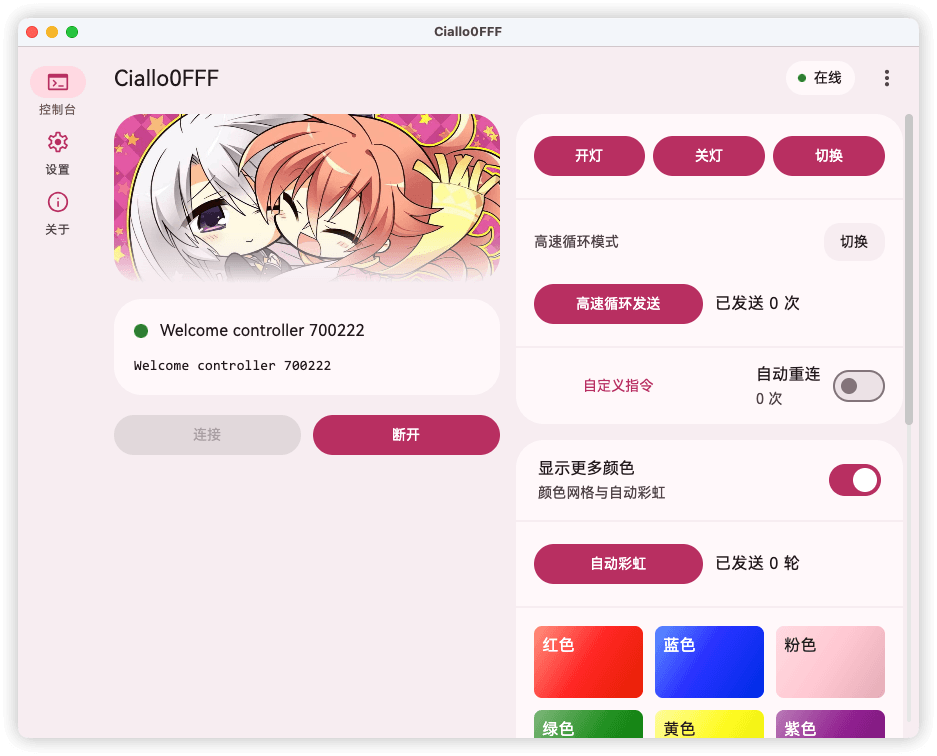
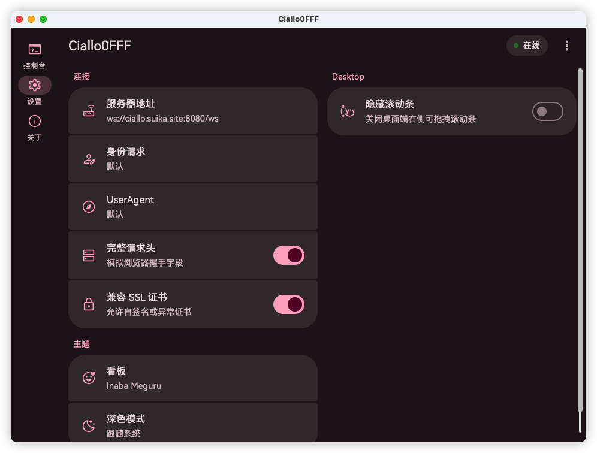
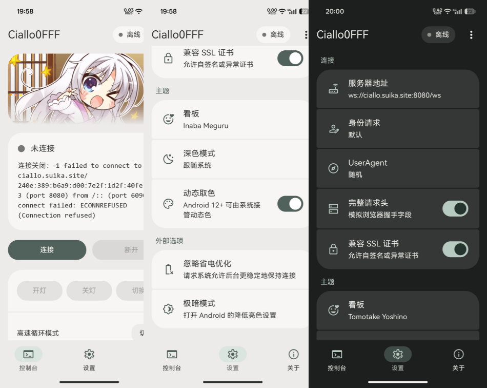

# Ciallo0FFF Multiplatform

Ciallo0FFF is a Kotlin Multiplatform WebSocket controller for the **0fff.top** live background service. It provides a MD3E styled control panel for sending color commands, switching kanban artwork, and testing the controller protocol across mobile and desktop platforms.

## Screenshots

| Desktop(Light) | Desktop(Dark) | Phone |
| --- | --- | --- |
|  |  |  |

## Supported Platforms

| Platform   | Architecture                          | Minimum      |
|------------|---------------------------------------------|--------------|
| Android    | arm64, x64                            | Android 10   |
| Windows    | x64                                   | Windows 10   |
| macOS      | arm64, x64                            | macOS 11     |
| iOS        | arm64                                 | iOS 16       |
| Linux      | Untested, build it yourself           |              |

## Tech Stack

- Kotlin Multiplatform & Compose Multiplatform
- Material 3 Expressive inspired UI
- Java-WebSocket on Android and JVM desktop
- NSURLSessionWebSocketTask on iOS
- Gradle multi-module project structure

## Features

- Custom server address and identity payload
- Light, dark, and system theme modes
- Android dynamic color support
- Color grid and rainbow command controls
- Desktop, Android, and iOS UI adaptation
- Development mode for local UI/protocol testing

## Build

Use JDK 21.

```powershell
.\gradlew.bat :desktopApp:run
```

```powershell
.\gradlew.bat :androidApp:assembleDebug
```

```powershell
.\gradlew.bat :desktopApp:packageDistributionForCurrentOS
```

iOS builds require macOS and Xcode:

```bash
./gradlew :shared:linkReleaseFrameworkIosArm64
```

Linux desktop packaging is configured but has not been tested. Build and verify it on your own target distribution.

## Protocol

The default controller identity payload is:

```json
{"client_type":"controller","client_id":null}
```

A basic color command looks like this:

```json
{"type":"command","command":"set_background","color":"white","text_label":"开灯"}
```

## License

Apache-2.0. See [LICENSE](https://github.com/daisukiKaffuChino/Ciallo0FFF-Multiplatform?tab=Apache-2.0-1-ov-file).
